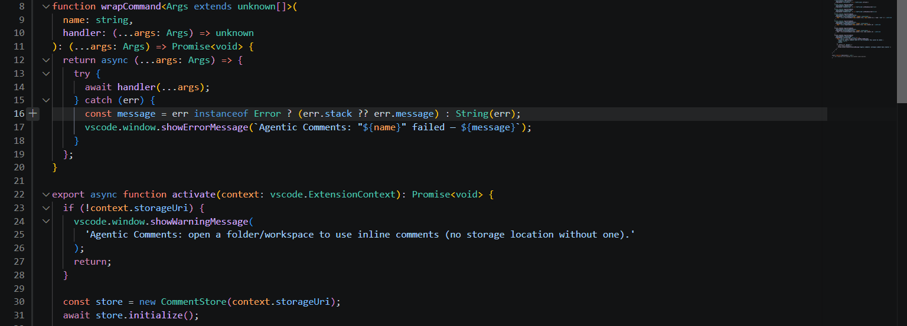
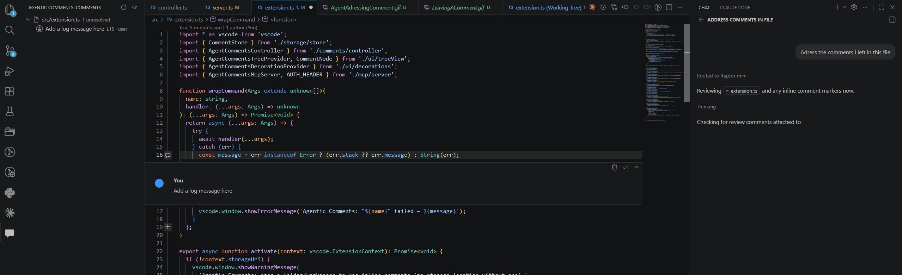

# Agentic Comments

Leave GitHub-style inline review comments on your live code, and let AI coding agents read, act on, and resolve them — no git, no PR, no copy-pasting file paths into a chat box.

**Leave a comment**

**An agent addresses it**

## Features

- **Inline comments, right in the gutter** — hover any line for the native "+", or right-click a line/selection → **Add Comment**. One message per comment, no reply threads to manage.
- **Comments survive edits** — anchored by content hash plus surrounding context, not just a line number. As code shifts, a comment stays `exact`, degrades to `approximate` (relocated nearby), or is flagged `orphaned` if the code is gone — never silently deleted or hidden. An orphaned comment stays frozen where it was last confidently placed, and always shows the original code snippet it was about, so it never gets impossible to recognize.
- **Built for agents, not just humans** — an in-process MCP server exposes your comments as structured tools (list, fetch, create, resolve), so an agent can pull exactly what's unresolved in a file or across the whole workspace instead of you re-explaining it in chat.
- **User vs. agent, at a glance** — blue author icon for comments you wrote, red for ones an agent left; resolved comments carry a "resolved by user/agent" tag.
- **Edit comment text** — pencil icon on hover, Save/Cancel to confirm; text only, unresolved comments only, works on any comment regardless of who wrote it.
- **Dedicated sidebar** — comments grouped by file, unresolved by default with a toggle to show resolved, inline Resolve/Reopen/Delete actions, click-to-jump navigation.
- **Explorer badges** — files with unresolved comments get a count badge, the same way VS Code marks modified files for git.
- **Never touches git** — nothing is written inside your repo folder. Comments live in VS Code's own per-workspace extension storage.

## Commands

| Command | Trigger |
|---|---|
| **Add Comment** | Gutter "+" on hover, or right-click a line/selection in the editor |
| **Resolve** / **Reopen** | Comment thread title bar, or inline in the sidebar |
| **Delete** | Comment thread title bar, or inline in the sidebar — permanent, works on unresolved and resolved comments alike |
| **Edit** / **Save** / **Cancel** | Pencil icon on hover, then Save/Cancel buttons — text only, unresolved comments only |
| **Reveal Comment** | Click a comment in the sidebar — jumps to it and expands the thread |
| **Show Resolved Comments** / **Hide Resolved Comments** | Sidebar toolbar |
| **Refresh** | Sidebar toolbar |
| **Clear All Comment Data for This Workspace** | Command Palette — deletes all stored comments for the workspace; irreversible |

## MCP Tools

Any MCP-compatible agent gets these tools automatically once the extension is active — enable/disable them per your agent's own tool picker, same as any other MCP tool.

| Tool | What it does |
|---|---|
| `list_unresolved_comments` | List unresolved comments, optionally scoped to one file, grouped by file |
| `get_comments` | Fetch comments for one or more files, optionally including resolved ones |
| `add_comments` | Create one or more comments in a single call, grouped by file |
| `resolve_comments` | Resolve one or more comments by id, grouped by file |

Every response flags comments whose anchor isn't exact (`locationUncertain: true`) rather than hiding them, so an agent always knows when to double-check a line number before trusting it. Comments also carry an `originalContent` snippet of the code they were originally about — by default on every comment (so an agent can judge relevance without a separate file read), configurable via **Settings** below.

## Settings

| Setting | Default | What it does |
|---|---|---|
| `agenticComments.mcp.alwaysIncludeSnippet` | `true` (experimental) | Include `originalContent` on every MCP comment response, not just ones with an uncertain anchor location. Turn off to only include it when `locationUncertain` is true. |
| `agenticComments.mcp.snippetMaxChars` | `500` | Maximum characters of `originalContent` before truncation. `0` omits the snippet entirely. |

## Release Notes

### 0.3.0
- Orphaned comments no longer drift to the wrong place on later edits — once orphaned, a comment's position is frozen for good.
- The original code a comment was about is now preserved and shown wherever its anchor is degraded (editor, sidebar, and MCP responses), so a relocated or orphaned comment is never a mystery.
- New experimental MCP settings to control snippet inclusion and size.
- Edit comments from the gutter.

### 0.2.2
- Improved tool descriptions to improve adherence

---

**[Report an issue](https://github.com/ChefGus123/vscode-comments/issues)** · [License: MIT](LICENSE)
