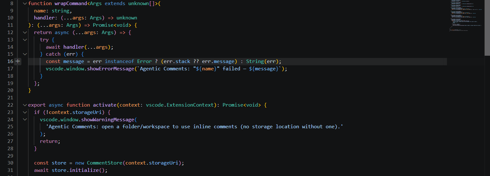
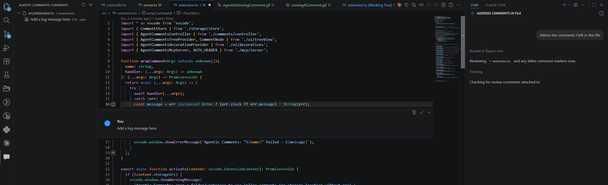

# Agentic Comments

Leave GitHub-style inline review comments on your live code, and let AI coding agents read, act on, and resolve them — no git, no PR, no copy-pasting file paths into a chat box.

[](LICENSE)
[](https://github.com/ChefGus123/vscode-comments/issues)

**Leave a comment**



**An agent addresses it**



## Features

- **Inline comments, right in the gutter** — hover any line for the native "+", or right-click a line/selection → **Add Comment**. One message per comment, no reply threads to manage.
- **Comment on rendered Markdown** — right-click any block in VS Code's built-in Markdown preview → **Add Comment**, and it anchors to the matching line of the source `.md`. Select across several blocks first and the comment covers the whole span; the input box tells you which lines it captured before you type. Review a doc the way you'd read it, not as raw syntax. (Comments show up in the editor gutter and sidebar as usual — the preview itself stays clean.)
- **Comments survive edits** — anchored by content hash plus surrounding context, not just a line number. As code shifts, a comment stays `exact`, degrades to `approximate` (relocated nearby), or is flagged `orphaned` if the code is gone — never silently deleted or hidden. An orphaned comment stays frozen where it was last confidently placed, and always shows the original code snippet it was about, so it never gets impossible to recognize.
- **Built for agents, not just humans** — an in-process MCP server exposes your comments as structured tools (list, fetch, create, resolve), so an agent can pull exactly what's unresolved in a file or across the whole workspace instead of you re-explaining it in chat.
- **User vs. agent, at a glance** — blue author icon for comments you wrote, red for ones an agent left; resolved comments carry a "resolved by user/agent" tag.
- **Edit comment text** — pencil icon on hover, Save/Cancel to confirm; text only, unresolved comments only, works on any comment regardless of who wrote it.
- **Dedicated sidebar** — comments grouped by file, unresolved by default with a toggle to show resolved, inline Resolve/Reopen/Delete actions, click-to-jump navigation.
- **Explorer badges** — files with unresolved comments get a count badge, the same way VS Code marks modified files for git.
- **Never touches git** — nothing is written inside your repo folder. Comments live in VS Code's own per-workspace extension storage.
- **Harness agnostic** - Whether your coding agents runs natively within VSCode or in our terminal: the exposed MCP server runs on localhost, supports fixed port mappings and OAuth. Just point your agent at it and you're ready to go!

## Commands

| Command | Trigger |
|---|---|
| **Add Comment** | Gutter "+" on hover, or right-click a line/selection in the editor |
| **Add Comment** (Markdown preview) | Right-click a block in the built-in Markdown preview — anchors to the matching line of the source `.md`, or to every block a selection touches |
| **Resolve** / **Reopen** | Comment thread title bar, or inline in the sidebar |
| **Delete** | Comment thread title bar, or inline in the sidebar — permanent, works on unresolved and resolved comments alike |
| **Edit** / **Save** / **Cancel** | Pencil icon on hover, then Save/Cancel buttons — text only, unresolved comments only |
| **Reveal Comment** | Click a comment in the sidebar — jumps to it and expands the thread |
| **Show Resolved Comments** / **Hide Resolved Comments** | Sidebar toolbar |
| **Refresh** | Sidebar toolbar |
| **Clear All Comment Data for This Workspace** | Command Palette — deletes all stored comments for the workspace; irreversible |

## Connecting agents

Agentic Comments talks to AI agents over [MCP](https://modelcontextprotocol.io). The server runs inside VS Code, only on your machine, and is available while the extension is active.

### GitHub Copilot

Nothing to set up. The extension registers itself with VS Code, and Copilot picks up the tools automatically. You can turn individual tools on or off from Copilot's tool picker.

### Other agents (Claude Code, Cursor, Codex, …)

Any agent that supports HTTP MCP servers can connect:

1. **Pick a fixed port.** In the workspace's `.vscode/settings.json`, set a port, then reload the window:
```json
   { "agenticComments.mcp.port": 47100 }
```
   Use a different port for each workspace you open at the same time.
2. **Add the server to your agent** at `http://127.0.0.1:47100/mcp`. For example, in Claude Code:
```bash
   claude mcp add --transport http agentic-comments http://127.0.0.1:47100/mcp
```
3. **Approve it once.** When the agent first connects, it opens a sign-in page and VS Code asks whether to allow it. Click **Allow**. Your agent stays connected across VS Code restarts.

VS Code needs to be open on the same folder your agent is working in. The server's address is also shown in the **Agentic Comments** output channel.

### Tools

| Tool | What it does |
|---|---|
| `list_unresolved_comments` | List unresolved comments across the workspace, or in one file |
| `get_comments` | Get comments for one or more files, optionally including resolved ones |
| `add_comments` | Leave one or more comments in a single call |
| `resolve_comments` | Resolve one or more comments by id |

If the code around a comment has changed, the comment is marked `locationUncertain`, so the agent knows to check the line before relying on it. Each comment also includes a snippet of the code it was left on, which you can adjust under **Settings**.

## Settings

| Setting | Default | What it does |
|---|---|---|
| `agenticComments.editor.hideResolvedComments` | `true` | Hide resolved comments from the editor gutter to reduce clutter. They stay accessible from the sidebar with Show Resolved on. |
| `agenticComments.mcp.alwaysIncludeSnippet` | `true` (experimental) | Include `originalContent` on every MCP comment response, not just ones with an uncertain anchor location. Turn off to only include it when `locationUncertain` is true. |
| `agenticComments.mcp.snippetMaxChars` | `500` | Maximum characters of `originalContent` before truncation. `0` omits the snippet entirely. |
| `agenticComments.mcp.port` | `0` | Local MCP HTTP port. `0` chooses a random available port; set a port number for a stable endpoint. Restart the extension host after changing it. |

## Release Notes

### 0.4.5
- **Harness-agnostic MCP access** — connect localhost MCP clients outside VS Code using a logged endpoint and an optional fixed port.
- **Built-in OAuth 2.1** — clients can use discovery, dynamic registration, PKCE, refresh tokens, and revocation without enabling an extension setting.
- **Explicit authorization** — every OAuth authorization request requires approval in VS Code; the existing per-session token remains available to VS Code.
- **Concurrent clients** — OAuth and session-token clients use isolated MCP sessions and can operate at the same time.

### 0.4.0
- **Comment on rendered Markdown.** Right-click any block in VS Code's built-in Markdown preview → **Add Comment**, and it anchors to the matching line of the source `.md`. Review a doc the way you read it, not as raw syntax.
- Select across several blocks first and the comment covers the whole span. Because Markdown's source mapping is block-level, a selection always widens to whole blocks — so the input box tells you exactly which lines it captured before you type.
- Comments made from the preview are ordinary comments: same gutter, same sidebar, same MCP tools, indistinguishable from ones you left in the editor. The preview itself stays clean — nothing is rendered over your document.

### 0.3.1
- Resolved comments are now hidden from the editor gutter by default (still accessible from the sidebar) — new `agenticComments.editor.hideResolvedComments` setting.

### 0.3.0
- Orphaned comments no longer drift to the wrong place on later edits — once orphaned, a comment's position is frozen for good.
- The original code a comment was about is now preserved and shown wherever its anchor is degraded (editor, sidebar, and MCP responses), so a relocated or orphaned comment is never a mystery.
- New experimental MCP settings to control snippet inclusion and size.
- Edit comments from the gutter.

### 0.2.2
- Improved tool descriptions to improve adherence

---

**[Report an issue](https://github.com/ChefGus123/vscode-comments/issues)** · [License: MIT](LICENSE)
