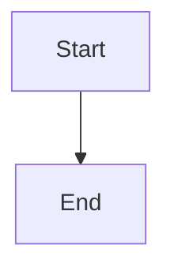

# Neighbour Menu Items

This file exists to check that our context-menu item does not clobber the ones VS Code and other
extensions already contribute to the Markdown preview.

Paragraph before the mermaid diagram.

Paragraph between the diagram and the image.

Final paragraph.
